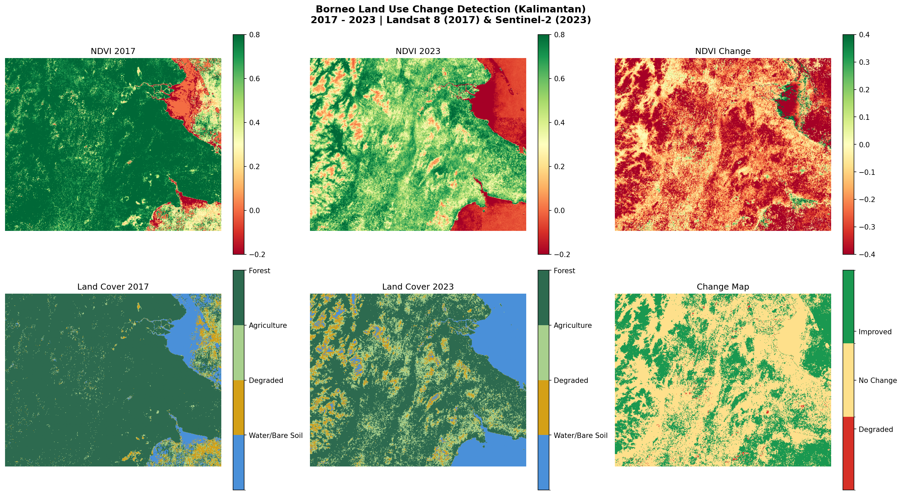

# Land Use Change Detection — East Kalimantan, Borneo

Detecting deforestation and land use change in East Kalimantan, Borneo, Indonesia (ROI: 116°E–118.5°E, 0.5°N–2.5°N) using Sentinel-2 satellite imagery and NDVI-based classification.

## Study Area & Time Window

- **Region:** East Kalimantan, Indonesian Borneo
- **Period:** 2017 - 2023
- **Reason for choosing Kalimantan:** One of the most heavily deforested regions on Earth due to palm oil expansion. The change signal is strong and well-documented, making it ideal for validation.

## Methodology

1. **Data:** Landsat 8 Collection 2 (2017) and Sentinel-2 Surface Reflectance (2023) via Google Earth Engine
   - Landsat 8 used for 2017 because Sentinel-2 coverage over Borneo was incomplete in early years (launched June 2015, sparse tropical coverage before 2019)
   - Sentinel-2 used for 2023 for higher spatial resolution (10m vs 30m) and denser revisit frequency
   - Both sensors provide comparable surface reflectance products suitable for NDVI computation2. 
2. **Cloud masking:** QA_PIXEL band (Landsat 8) and QA60 band (Sentinel-2)
3. **Compositing:** Annual median composite to produce one clean, cloud-free image per year
4. **NDVI computation:** (NIR - Red) / (NIR + Red)
   - Landsat 8: SR_B5 (NIR) and SR_B4 (Red)
   - Sentinel-2: B8 (NIR) and B4 (Red)
5. **Classification:** Threshold-based land cover mapping into 4 classes:
   - Water / Bare soil (NDVI < 0.1)
   - Degraded / Sparse vegetation (0.1 – 0.3)
   - Agriculture / Young plantation (0.3 – 0.5)
   - Dense forest (NDVI > 0.5)
6. **Change detection:** Pixel-wise subtraction of 2017 vs 2023 classifications

## Results



| Class | 2017 | 2023 |
|---|---|---|
| Water / Bare soil | 7.1% | 17.2% |
| Degraded | 3.3% | 7.0% |
| Agriculture | 4.5% | 20.3% |
| Forest | 85.2% | 55.5% |

Forest cover declined by ~30 percentage points over 6 years, consistent with 
palm oil expansion and timber clearing documented in East Kalimantan.

## Tools & Libraries

- Python 3.12
- Google Earth Engine API (`earthengine-api`)
- `geemap`, `rasterio`, `numpy`, `matplotlib`

## How to Run

```bash
# Step 1 — download and process data
# Set TRAIN = True in main.py, then:
python main.py

# Step 2 — visualize results
# Set TRAIN = False in main.py, then:
python main.py
```

## References

- Hansen et al. (2013) — High-Resolution Global Maps of 21st-Century Forest Cover Change
- Sentinel-2 Mission Guide — ESA
- USGS Landsat 8 Collection 2 Surface Reflectance Product Guide